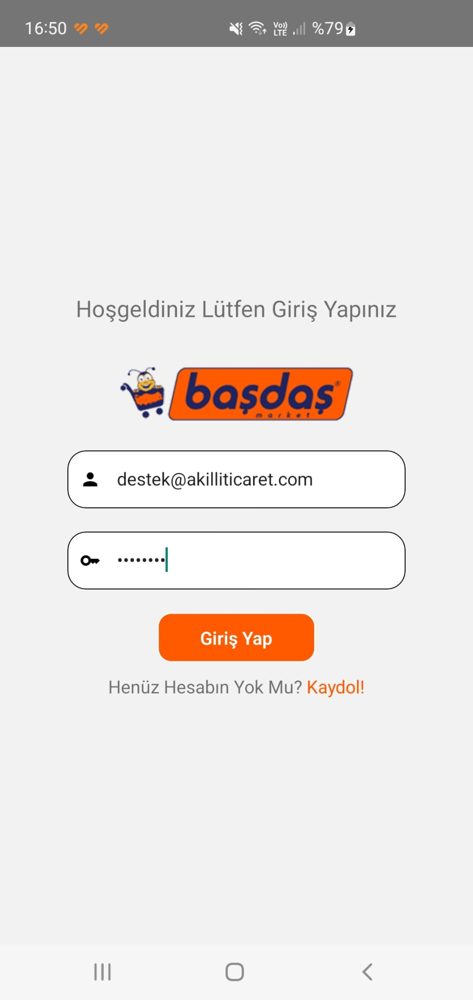
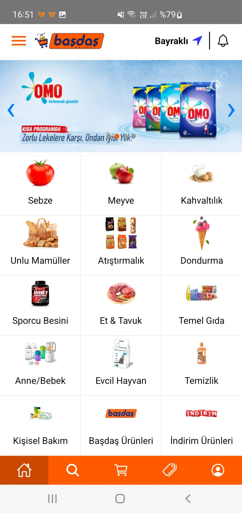
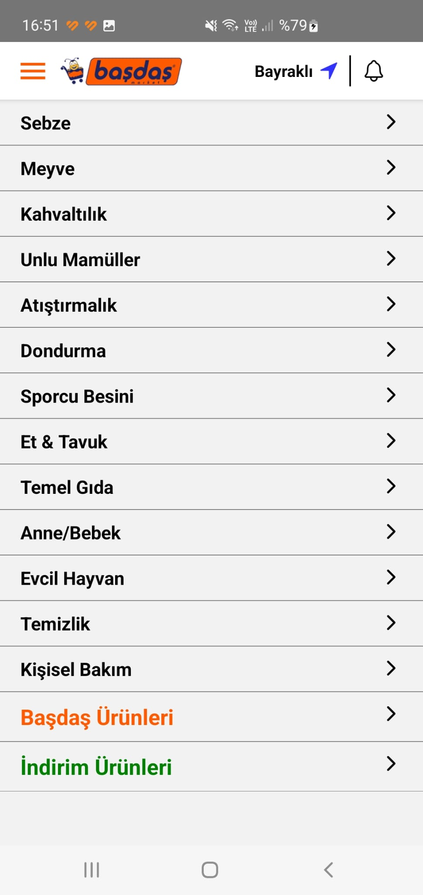
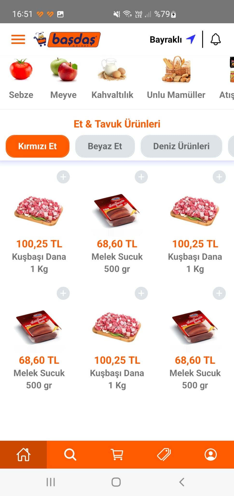
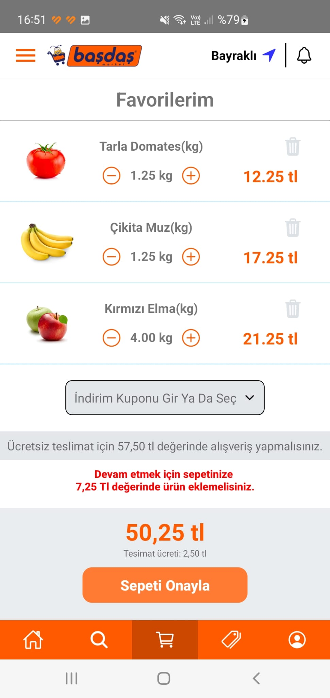

# kmz-coding-test
## Bilgiler:

- React Native dilinde tsx kullanılarak yazılmıştır.
- Login örnek kullanıcı ile giriş yapılmıştır.
- Api kategorilerin Guid bilgisine göre eksik geldiği için Postman da geçiçi api ile kategoriler çekilmiştir. Json dosyası koda eklenmiştir. (swagger url de sorunu çözemedim 401 yetkiniz yok hatası alıyordum domain guıd ile)
- Cart sayfası sitatik ekrandır.

## Örnek Sayfalar: 

-Android s10 plus ekran görüntüleridir.

### Login: 

### Main: 

### Menu: 

### SubCategory: 

### Cart: 

